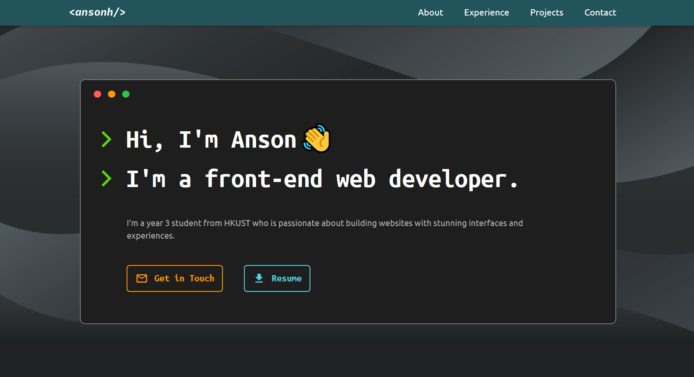

# Anson Heung - Personal Site

My personal site hosted with GitHub Pages and built with HTML, Sass and Javascript.



## :hammer_and_wrench: Development

This project uses [Dart Sass](https://sass-lang.com/) CSS preprocessor. Please install the Dart Sass CLI via npm if you haven't:

```
npm install -g sass
```

To start the development server using VS Code's [Live Server](https://marketplace.visualstudio.com/items?itemName=ritwickdey.LiveServer) extension:

1. Clone this project to your computer
   ```
   git clone https://github.com/AnsonH/AnsonH.github.io.git
   ```
2. Open the root folder you just cloned in VS Code
3. Install the [Live Server](https://marketplace.visualstudio.com/items?itemName=ritwickdey.LiveServer) extension
4. Press the "Go Live" button in the status bar to start the development server
5. In VS Code, open a new integrated Terminal window
6. Run the following command and leave it running in background
   ```
   sass app/scss:css
   ```
